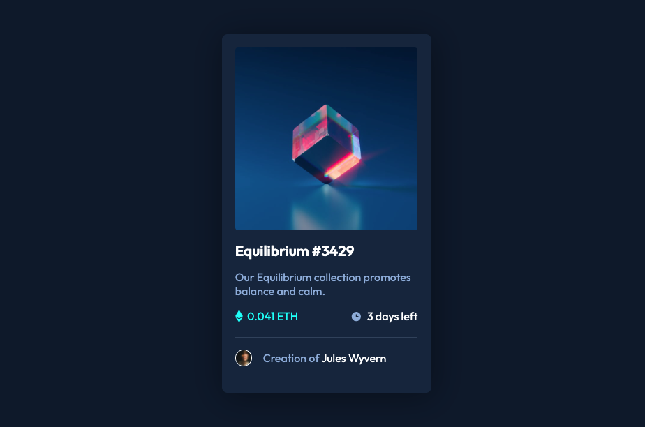

# Frontend Mentor - NFT preview card component


## Welcome! 👋

Thanks for checking out this front-end coding challenge.
## Table of contents

- [Overview](#overview)
  - [The challenge](#the-challenge)
  - [Screenshot](#screenshot)
  - [Links](#links)
- [My process](#my-process)
  - [Built with](#built-with)
  - [What I learned](#what-i-learned)
- [Author](#author)


## Overview

### The challenge

Users should be able to:

- View the optimal layout depending on their device's screen size
- See hover states for interactive elements

### Screenshot




### Links

- Live Site URL: [Live Demo](https://nft-card-component-o.netlify.app)

## My process

### Built with

- Semantic HTML5 markup
- CSS custom properties
- Flexbox
- Mobile-first workflow


### What I learned

- CSS Transitions, and that transition wont work for the "display" property.

```css

.card__image-overlay{
    position: absolute;
    top: 0;
    left: 0;
    width: 100%;
    height: 100%;
    background: var(--cyan-transparent);
    display: flex;
    flex-direction: column;
    justify-content: center;
    align-items: center;
    opacity: 0;
    transition: all .7s;
}

.card__image-container:hover .card__image-overlay{
    opacity: 1;
    cursor: pointer;
}

```


## Author
- Frontend Mentor - [@Master-Osaro](https://www.frontendmentor.io/profile/yourusername)
- Twitter - [@iyoha_osaro](https://www.twitter.com/yourusername)
